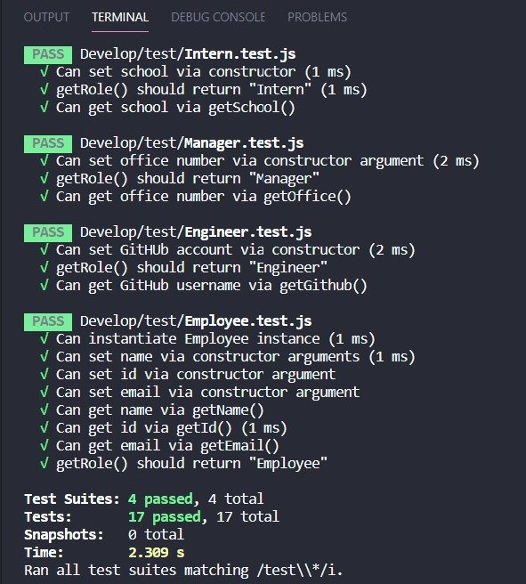

# Team Roster Generator

## Project Summary

Team Roster Generator is a Node CLI that generates a well-formatted HTML page based on user input. 

## Table of Contents 

<details>
 <summary>Click to view Table of Contents ...</summary>
 <p>

 - [Getting Started](#getting-started)
 - [MVP](#mvp)
 - [User Input](#user-input)
 - [Roster Output](#roster-output)
 - [Installation](#installation)
 - [Testing](#testing)
 - [Application Example](#application-example)
 - [Contact](#contact)


</p>
</details>


## User Story

```
As a manager
I want to generate a webpage that displays my team's basic info
so that I have quick access to emails and GitHub profiles
```

## Getting Started 

In the `Develop` folder, there is a `package.json`, so make sure to `npm install`.

The dependencies are, [jest](https://jestjs.io/) for running the provided tests, and [inquirer](https://www.npmjs.com/package/inquirer) for collecting input from the user.

There are also unit tests to help you build the classes necessary.

It is recommended that you follow this workflow:

1. Run tests
2. Create or update classes to pass a single test case
3. Repeat

🎗 Remember, you can run the tests at any time with `npm run test`

## MVP

* Functional application.

* GitHub repository with a unique name and a README describing the project.

* User can use the CLI to generate an HTML page that displays information about their team.

* All tests must pass.


### User input

The project will prompt the user to build an engineering team. An engineering
team consists of a manager, and any number of engineers and interns.

### Roster output

The project generates a `team.html` page in the `output` directory, that displays a nicely formatted team roster. Each team member displays the following in no particular order:

  * Name

  * Role

  * ID

  * Role-specific property (School, link to GitHub profile, or office number)

## Installation

In order for this application to function properly, the following are needed: 
- Node.js - This application uses Node.js, so ensure that you have it installed. 

### Dependencies
- [inquirer](https://www.npmjs.com/package/inquirer) - This is used to collect input form the user
- [jest](https://jestjs.io/) - This is used to run unit tests

## Testing
To run a test, use the command `npm run test`. The test should operate as demonstrated below: 



## Application Example


## Contact 

LinkedIn: https://linkedin.com/in/rachaeladu/ | Portfolio: https://rad-a.github.io/08_portfolio/